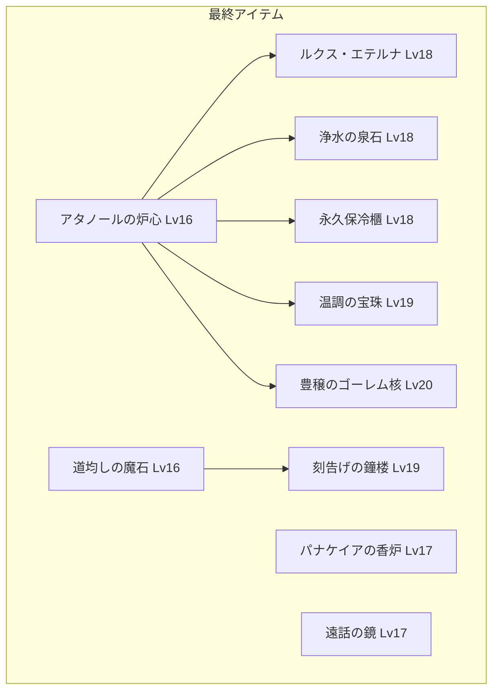
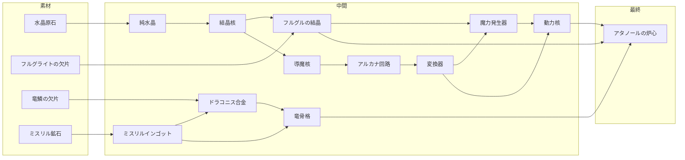
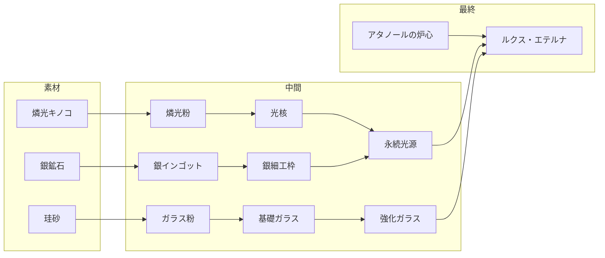
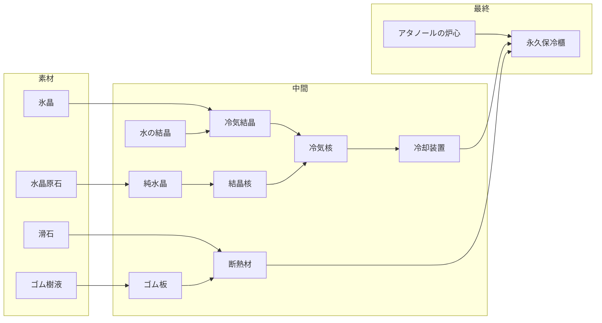
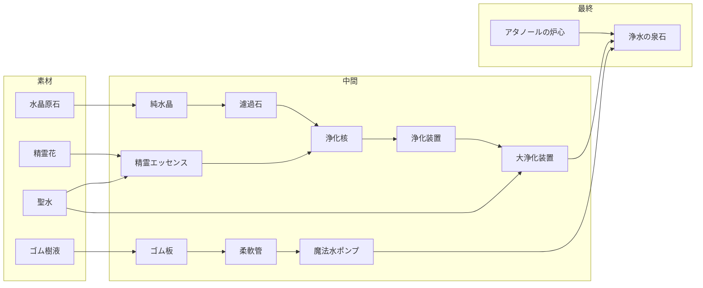
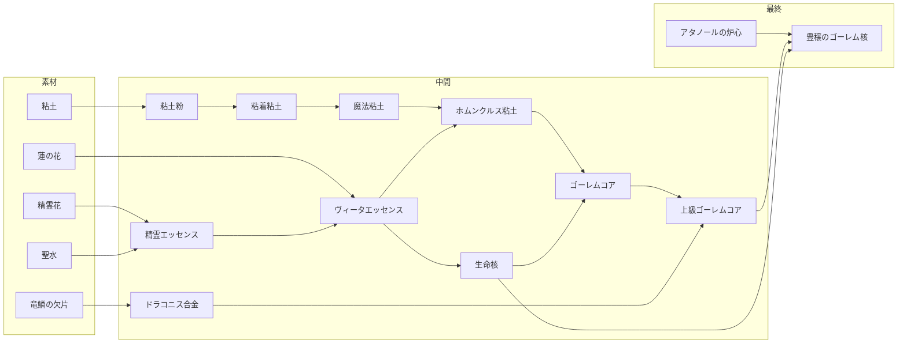
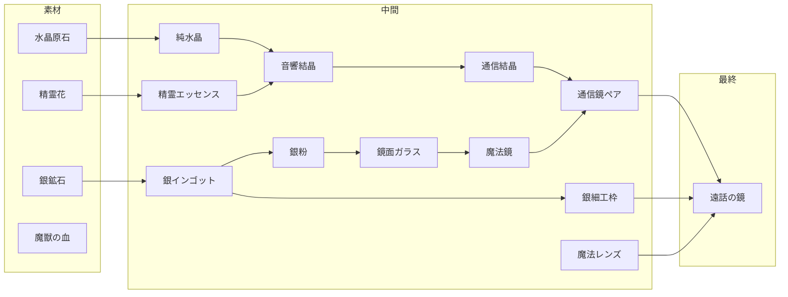
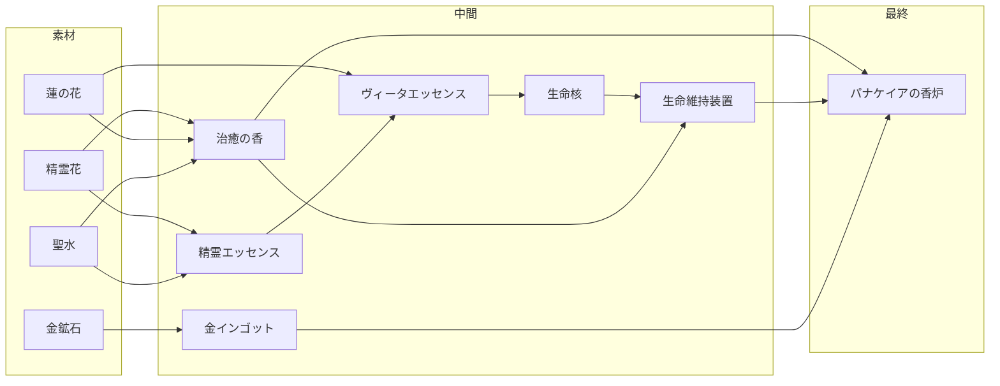
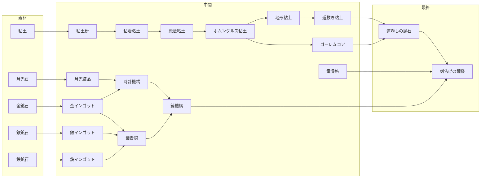
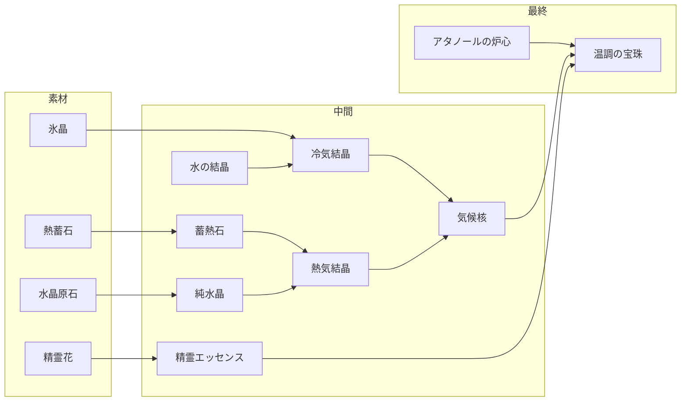

# 錬金アイテムツリー設計書

## 概要

村興しに役立つ最終アイテム10個と、それを作るための中間アイテム。
合計約150個のアイテムで構成される錬成ツリー。

### 設計方針
- 中間アイテムの多くはそれ自体が依頼や売却で価値を持つ
- 一部の最終アイテムは他の最終アイテムの材料になる
- ループは存在しない（DAG構造）
- 既存アイテム（15個）を活用しつつ拡張

---

## アイテム総数

| カテゴリ | 個数 |
|---------|------|
| 採取素材（既存） | 8 |
| 採取素材（新規） | 27 |
| 生成物（既存） | 7 |
| 生成物（新規） | 108 |
| **合計** | **150** |

---

## 最終アイテム依存関係

---

## 系統別依存関係図

### 動力系（アタノールの炉心）
他の多くの最終アイテムの基盤となる動力源。
*Athanor = 錬金術師が使う持続加熱炉*

### 光系（ルクス・エテルナ）
照明インフラ。アタノールの炉心を動力源として使用。
*Lux Aeterna = 永遠の光*

### 冷却系（永久保冷櫃）
食料保存インフラ。

### 浄水系（浄水の泉石）
水道インフラ。

### 生命・ゴーレム系（豊穣のゴーレム核）
農業革命をもたらす自動化ゴーレム。

### 通信系（遠話の鏡）
通信インフラ。アタノール不要の独立系。

### 医療系（パナケイアの香炉）
医療施設。アタノール不要の独立系。
*Panacea = ギリシャ神話の万能薬の女神*

### 建築・時計系（道均しの魔石 → 刻告げの鐘楼）
公共インフラ。道均しの魔石は鐘楼の材料にもなる。

### 気候系（温調の宝珠）
居住環境改善。熱と冷気の両方を制御。

---

## ナラティブプロット

### 最終アイテム

| アイテム | プロット |
|----------|----------|
| アタノールの炉心 | 村長が「昔この村には錬金術師がいて、不思議な炉があった」と語る。その再現を頼まれる。 |
| ルクス・エテルナ | 夜道で転んで怪我をした子供。母親から「街灯があれば」と相談される。 |
| 浄水の泉石 | 井戸水が濁り始め、村人が体調を崩す。清潔な水の確保が急務に。 |
| 永久保冷櫃 | よろず屋の店主が「夏場は食材が腐って困る」と嘆く。商売の生命線。 |
| 温調の宝珠 | 厳しい冬、老人が凍えそうになる。村の集会所に暖房が必要だ。 |
| パナケイアの香炉 | 流行病の噂が近隣の村から届く。予防と治療の備えを村長が求める。 |
| 遠話の鏡 | 行商人が「街との連絡手段があれば商機を逃さないのに」と愚痴る。 |
| 道均しの魔石 | 雨の日はぬかるみで荷車が動けない。街道整備が交易復活の鍵。 |
| 刻告げの鐘楼 | 村人の生活リズムがバラバラで共同作業が進まない。時報が必要だ。 |
| 豊穣のゴーレム核 | 人手不足で畑が荒れていく。「人の代わりに働く何か」への切実な願い。 |

### ハブアイテム（複数の最終形に使われる重要素材）

| アイテム | プロット |
|----------|----------|
| 結晶核 | 師匠の手紙に「すべての魔道具の心臓は結晶核だ」と書かれていた。 |
| アルカナ回路 | 古い魔導書に載っていた図面。これがあれば魔力を制御できる。 |
| フルグルの結晶 | 嵐の夜、山に雷が落ちた。翌日そこで見つけた輝く石の欠片。 |
| ホムンクルス粘土 | 錬金術師の夢、「生命を模倣する土」。ゴーレム作りの第一歩。 |
| ヴィータエッセンス | 蓮の花と精霊の祝福が出会うとき、命の輝きが滴り落ちる。 |
| ドラコニス合金 | 竜の鱗を溶かし込んだ金属。これ以上の強度は存在しない。 |
| ニグレドの炭 | 錬金術の第一歩、黒化。すべての変容はここから始まる。 |

---

## 1. 採取素材一覧（35種）

### 既存素材（8種）
| ID | 名前 | カテゴリ | 入手先 | 価格 |
|----|------|----------|--------|------|
| herb_01 | 薬草 | herb | 森 | 10 |
| herb_02 | 毒消し草 | herb | 森 | 20 |
| ore_01 | 鉄鉱石 | ore | 山 | 30 |
| ore_02 | 銀鉱石 | ore | 山(レア) | 100 |
| water_01 | 清水 | water | 湖 | 5 |
| water_02 | 聖水 | water | 湖(レア) | 200 |
| misc_01 | 獣の皮 | misc | 森 | 25 |
| misc_02 | 魔獣の牙 | misc | 山(レア) | 150 |

### 新規素材：森エリア（9種）
| ID | 名前 | カテゴリ | レア度 | 価格 | 説明 |
|----|------|----------|--------|------|------|
| oil_seed | 油草の実 | plant | 普通 | 8 | 油分を多く含む種子 |
| hemp_fiber | 麻繊維 | plant | 普通 | 12 | 丈夫な植物繊維 |
| magic_wood | 魔木の枝 | wood | 普通 | 20 | 魔力を帯びた木材 |
| glow_mushroom | 燐光キノコ | plant | レア | 45 | 暗闇で淡く光るキノコ |
| forest_moss | 森苔 | plant | 普通 | 6 | しっとりとした苔 |
| honey | 森蜂蜜 | misc | 普通 | 25 | 野生蜂の蜜 |
| tree_resin | 樹脂 | misc | 普通 | 15 | 木から滲み出た樹液 |
| rubber_sap | ゴム樹液 | misc | レア | 40 | 弾力のある樹液 |
| spirit_flower | 精霊花 | plant | レア | 80 | 精霊が宿るといわれる花 |

### 新規素材：山エリア（9種）
| ID | 名前 | カテゴリ | レア度 | 価格 | 説明 |
|----|------|----------|--------|------|------|
| crystal_ore | 水晶原石 | ore | 普通 | 35 | 透明な結晶の原石 |
| whetstone_ore | 砥石鉱 | ore | 普通 | 25 | 研磨に使われる石 |
| coal | 石炭 | ore | 普通 | 15 | よく燃える黒い石 |
| sulfur | 硫黄 | ore | 普通 | 30 | 黄色い鉱物、独特の臭い |
| thunder_shard | フルグライトの欠片 | crystal | レア | 120 | 雷が地面に落ちてできた天然ガラス |
| beast_blood | 魔獣の血 | misc | レア | 90 | 魔力を含んだ血液 |
| gold_ore | 金鉱石 | ore | レア | 200 | 貴重な金の原石 |
| talc | 滑石 | ore | 普通 | 20 | 保温性の高い鉱物 |
| magma_stone | 熱蓄石 | ore | レア | 150 | 熱を蓄える赤い石 |

### 新規素材：湖エリア（6種）
| ID | 名前 | カテゴリ | レア度 | 価格 | 説明 |
|----|------|----------|--------|------|------|
| silica_sand | 珪砂 | ore | 普通 | 10 | ガラスの原料になる砂 |
| glow_moss | 発光苔 | plant | レア | 60 | 水辺で光る苔 |
| clay | 粘土 | ore | 普通 | 8 | 陶器の材料 |
| salt | 岩塩 | ore | 普通 | 12 | 料理や保存に使う塩 |
| ice_crystal | 氷晶 | crystal | レア | 100 | 溶けない不思議な氷 |
| lotus | 蓮の花 | plant | 普通 | 30 | 清らかな水に咲く花 |

### 新規素材：深部エリア（後半解禁）（3種）
| ID | 名前 | カテゴリ | レア度 | 価格 | 説明 |
|----|------|----------|--------|------|------|
| mithril_ore | ミスリル鉱石 | ore | 超レア | 500 | 伝説の銀色金属 |
| dragon_scale | 竜鱗の欠片 | misc | 超レア | 800 | 竜から剥がれ落ちた鱗 |
| moon_stone | 月光石 | crystal | 超レア | 600 | 月の光を吸収する石 |

---

## 2. 生成物一覧（115種）

### 既存生成物（7種）
| ID | 名前 | Lv | 日数 |
|----|------|----|------|
| potion_01 | 回復薬 | 1 | 1 |
| potion_02 | 上級回復薬 | 5 | 2 |
| antidote | 解毒薬 | 2 | 1 |
| bomb_01 | 爆弾 | 3 | 2 |
| ingot_01 | 鉄インゴット | 4 | 3 |
| ingot_02 | 銀インゴット | 8 | 3 |
| elixir | エリクシール | 15 | 5 |

---

### Tier 1: 基礎加工品（Lv1-3）- 18種

基本素材を少し加工したもの。序盤の金策や依頼対応に使う。

| ID | 名前 | Lv | 日数 | 材料 | 価格 | 用途 |
|----|------|----|------|------|------|------|
| plant_oil | 植物油 | 1 | 1 | 油草の実×2, 清水×1 | 30 | 灯火・潤滑・料理 |
| herbal_paste | 薬草ペースト | 1 | 1 | 薬草×3 | 40 | 軟膏の基材 |
| charcoal | 木炭 | 1 | 1 | 魔木の枝×3 | 25 | 燃料・脱臭 |
| rope | 麻縄 | 1 | 1 | 麻繊維×3 | 25 | 汎用資材 |
| simple_cloth | 麻布 | 2 | 1 | 麻繊維×4 | 40 | 衣料・濾過 |
| stone_powder | 砕石粉 | 2 | 1 | 砥石鉱×2 | 35 | 研磨剤原料 |
| purified_water | 精製水 | 2 | 1 | 清水×3, 森苔×1 | 20 | 各種調合の基礎 |
| resin_glue | 樹脂膠 | 2 | 1 | 樹脂×2, 植物油×1 | 45 | 接着剤 |
| dried_herbs | 乾燥薬草 | 2 | 1 | 薬草×2 | 25 | 保存用薬草 |
| salt_crystal | 精製塩 | 2 | 1 | 岩塩×2, 清水×1 | 30 | 調理・保存 |
| clay_powder | 粘土粉 | 2 | 1 | 粘土×2 | 20 | 陶器・建材 |
| honey_syrup | 蜂蜜シロップ | 2 | 1 | 森蜂蜜×1, 精製水×1 | 50 | 甘味料・薬の味付け |
| sulfur_powder | 硫黄粉 | 3 | 1 | 硫黄×2 | 50 | 火薬・殺菌 |
| filter_cloth | 濾過布 | 3 | 1 | 麻布×1, 精製水×2 | 55 | 液体の濾過用 |
| polishing_powder | 研磨剤 | 3 | 1 | 砕石粉×2, 植物油×1 | 60 | 金属の研磨 |
| basic_catalyst | 基礎触媒 | 3 | 1 | 薬草×2, 清水×1 | 45 | 錬金の促進剤 |
| rubber_sheet | ゴム板 | 3 | 1 | ゴム樹液×2 | 70 | 防水・弾性素材 |
| moss_extract | 苔エキス | 3 | 1 | 森苔×3, 精製水×1 | 55 | 冷却・保湿成分 |

---

### Tier 2: 初級錬金品（Lv4-6）- 22種

中間素材として重要なもの。一部は単体で依頼や売却の対象になる。

| ID | 名前 | Lv | 日数 | 材料 | 価格 | 用途 |
|----|------|----|------|------|------|------|
| lamp_oil | 灯火油 | 4 | 1 | 植物油×2, 燐光キノコ×1 | 80 | ランプ燃料 |
| quality_charcoal | ニグレドの炭 | 4 | 2 | 木炭×3, 精製水×1 | 70 | 高温燃料・濾過 |
| glass_powder | ガラス粉 | 4 | 1 | 珪砂×3 | 50 | ガラス製造原料 |
| healing_salve | 傷薬軟膏 | 4 | 1 | 薬草ペースト×1, 蜂蜜シロップ×1 | 90 | 外傷治療 |
| reinforced_cloth | 強化布 | 4 | 2 | 麻布×2, 樹脂膠×1 | 100 | 丈夫な布地 |
| black_powder | 黒色火薬 | 4 | 2 | 硫黄粉×1, 木炭×2, 精製塩×1 | 120 | 爆発物の基礎 |
| whetstone | 砥石 | 4 | 1 | 砥石鉱×3, 樹脂膠×1 | 75 | 刃物の研磨 |
| basic_glass | 基礎ガラス | 5 | 2 | ガラス粉×2, ニグレドの炭×1 | 90 | ガラス製品原料 |
| phosphor_powder | 燐光粉 | 5 | 1 | 燐光キノコ×3 | 100 | 発光素材 |
| water_crystal | 水の結晶 | 5 | 2 | 精製水×3, 岩塩×1 | 80 | 水属性の結晶 |
| ink_base | インク原液 | 5 | 1 | 木炭×2, 樹脂膠×1, 精製水×1 | 70 | 筆記・刻印用 |
| cooling_agent | 冷却剤 | 5 | 2 | 苔エキス×2, 水の結晶×1 | 110 | 冷却用薬剤 |
| fine_oil | 精製油 | 5 | 1 | 植物油×2, 濾過布×1 | 75 | 高品質な油 |
| glowing_ink | 発光インク | 5 | 2 | インク原液×1, 燐光粉×1 | 130 | 光るインク |
| ceramic_base | 陶器素地 | 5 | 2 | 粘土粉×3, 精製水×1 | 65 | 陶器の基礎 |
| strong_rope | 強化縄 | 5 | 1 | 麻縄×2, 樹脂膠×1 | 70 | 高耐久ロープ |
| basic_lens | 基礎レンズ | 6 | 2 | 基礎ガラス×2, 研磨剤×1 | 150 | 光学部品 |
| iron_powder | 鉄粉 | 6 | 1 | 鉄インゴット×1 | 80 | 金属加工用 |
| insulation_mat | 断熱材 | 6 | 2 | 滑石×2, ゴム板×1 | 140 | 熱を通さない素材 |
| pure_crystal | 純水晶 | 6 | 2 | 水晶原石×2, 精製水×2 | 120 | 魔力を通す結晶 |
| heat_stone | 蓄熱石 | 6 | 2 | 熱蓄石×1, ニグレドの炭×2 | 180 | 熱を蓄える石 |
| sticky_clay | 粘着粘土 | 6 | 1 | 粘土粉×2, 樹脂膠×1 | 60 | 成形用粘土 |

---

### Tier 3: 中級錬金品（Lv7-10）- 25種

専門的な中間素材。村人からの依頼でも登場する有用なアイテム。

| ID | 名前 | Lv | 日数 | 材料 | 価格 | 用途 |
|----|------|----|------|------|------|------|
| precision_tools | 精密工具 | 7 | 2 | 鉄インゴット×1, 砥石×1 | 200 | 細工作業用 |
| reinforced_glass | 強化ガラス | 7 | 2 | 基礎ガラス×2, 鉄粉×1 | 180 | 割れにくいガラス |
| magic_ink | グリモワールインク | 7 | 2 | 魔獣の血×1, 発光インク×1 | 250 | 魔法陣用インク |
| quality_ceramic | 上質陶器 | 7 | 2 | 陶器素地×2, ニグレドの炭×1 | 160 | 日用品・容器 |
| silver_powder | 銀粉 | 7 | 1 | 銀インゴット×1 | 280 | 魔法金属加工用 |
| fire_powder | 発火粉 | 7 | 2 | 黒色火薬×1, 硫黄粉×1 | 160 | 着火剤 |
| cold_crystal | 冷気結晶 | 7 | 2 | 氷晶×1, 水の結晶×1 | 220 | 冷気を発する結晶 |
| flexible_tube | 柔軟管 | 7 | 2 | ゴム板×2, 強化縄×1 | 170 | 液体輸送用 |
| filter_stone | 濾過石 | 8 | 2 | 純水晶×1, ニグレドの炭×2 | 200 | 水質浄化用 |
| heat_crystal | 熱気結晶 | 8 | 2 | 蓄熱石×1, 純水晶×1 | 240 | 熱を発する結晶 |
| magic_powder | 魔力の粉 | 8 | 2 | 魔獣の牙×1, 研磨剤×1 | 300 | 魔力付与の触媒 |
| spirit_essence | 精霊エッセンス | 8 | 2 | 精霊花×1, 聖水×1 | 350 | 精霊の力を凝縮 |
| quality_lens | 高精度レンズ | 8 | 2 | 基礎レンズ×1, 研磨剤×2 | 280 | 高品質光学部品 |
| waterproof_coating | 防水塗料 | 8 | 2 | ゴム板×1, 精製油×2 | 190 | 防水加工用 |
| conductive_wire | 導線 | 9 | 2 | 銀インゴット×1, 柔軟管×1 | 350 | 魔力伝導用 |
| crystal_core | 結晶核 | 9 | 2 | 純水晶×1, 魔力の粉×1 | 400 | 結晶系の核 |
| eternal_flame | イグニス・ペレニス | 9 | 3 | 発火粉×2, 蓄熱石×1, 精霊エッセンス×1 | 500 | 消えない永遠の炎 |
| frost_core | 冷気核 | 9 | 2 | 冷気結晶×2, 結晶核×1 | 450 | 冷却装置の核 |
| purification_core | 浄化核 | 9 | 2 | 濾過石×1, 精霊エッセンス×1 | 420 | 浄化装置の核 |
| thunder_crystal | フルグルの結晶 | 10 | 3 | フルグライトの欠片×2, 結晶核×1 | 550 | 電気を蓄える結晶 |
| mirror_glass | 鏡面ガラス | 10 | 2 | 強化ガラス×1, 銀粉×1 | 380 | 鏡の材料 |
| enchanted_clay | 魔法粘土 | 10 | 2 | 粘着粘土×2, 魔力の粉×1 | 320 | 魔法を込められる粘土 |
| life_essence | ヴィータエッセンス | 10 | 3 | 蓮の花×2, 精霊エッセンス×1 | 480 | 生命力の凝縮 |
| heat_regulator | 温度調整弁 | 10 | 2 | 熱気結晶×1, 冷気結晶×1, 導線×1 | 600 | 温度制御装置 |
| conductor_core | 導魔核 | 10 | 3 | 導線×2, 結晶核×1 | 520 | 魔力伝導の核 |

---

### Tier 4: 上級錬金品（Lv11-14）- 20種

複合的な中間素材。最終アイテムへの重要な構成要素。

| ID | 名前 | Lv | 日数 | 材料 | 価格 | 用途 |
|----|------|----|------|------|------|------|
| magic_circuit | アルカナ回路 | 11 | 3 | 導魔核×1, グリモワールインク×2 | 800 | 魔道具の制御部 |
| light_core | 光核 | 11 | 3 | フルグルの結晶×1, 燐光粉×2 | 700 | 発光装置の核 |
| silver_frame | 銀細工枠 | 11 | 3 | 銀インゴット×2, 精密工具×1 | 750 | 精密な銀製部品 |
| heat_core | 熱核 | 11 | 3 | イグニス・ペレニス×1, 結晶核×1 | 850 | 加熱装置の核 |
| gold_ingot | 金インゴット | 11 | 3 | 金鉱石×3 | 700 | 高級金属材料 |
| magic_mirror | 魔法鏡 | 12 | 3 | 鏡面ガラス×2, アルカナ回路×1 | 900 | 映像を映す鏡 |
| cooling_unit | 冷却装置 | 12 | 3 | 冷気核×2, アルカナ回路×1 | 950 | 冷却機能ユニット |
| heating_unit | 加熱装置 | 12 | 3 | 熱核×2, アルカナ回路×1 | 950 | 加熱機能ユニット |
| purifier_unit | 浄化装置 | 12 | 3 | 浄化核×2, アルカナ回路×1 | 900 | 浄化機能ユニット |
| mithril_ingot | ミスリルインゴット | 12 | 4 | ミスリル鉱石×3 | 1800 | 伝説の金属材料 |
| golem_clay | ホムンクルス粘土 | 13 | 3 | 魔法粘土×3, ヴィータエッセンス×1 | 1000 | ゴーレム素体用 |
| magic_lens | 魔法レンズ | 13 | 3 | 高精度レンズ×2, 魔力の粉×2 | 850 | 魔力を集束するレンズ |
| sound_crystal | 音響結晶 | 13 | 3 | 純水晶×2, 精霊エッセンス×2 | 800 | 音を伝える結晶 |
| terrain_clay | 地形粘土 | 13 | 3 | ホムンクルス粘土×1, 砕石粉×3 | 900 | 地形を操作する粘土 |
| power_converter | 変換器 | 14 | 3 | アルカナ回路×2, 導魔核×1 | 1200 | 魔力変換装置 |
| bell_alloy | 鐘青銅 | 14 | 3 | 銀インゴット×1, 鉄インゴット×2, 金インゴット×1 | 1100 | 響きの良い合金 |
| life_core | 生命核 | 14 | 4 | ヴィータエッセンス×2, 結晶核×1 | 1300 | 生命力を宿す核 |
| communication_crystal | 通信結晶 | 14 | 3 | 音響結晶×1, アルカナ回路×1 | 1150 | 遠距離通信用結晶 |
| dragon_alloy | ドラコニス合金 | 14 | 4 | 竜鱗の欠片×2, ミスリルインゴット×1 | 2500 | 最強の合金 |
| moon_crystal | 月光結晶 | 14 | 3 | 月光石×1, 結晶核×1 | 1400 | 時を知る結晶 |

---

### Tier 5: 最上級錬金品（Lv15-17）- 16種

最終アイテムの直接材料。一部はそれ自体が最終形に準じる価値を持つ。

| ID | 名前 | Lv | 日数 | 材料 | 価格 | 用途 | 単体効果 |
|----|------|----|------|------|------|------|----------|
| elixir | エリクシール | 15 | 5 | (既存) | 1000 | 万能薬 | 全回復 |
| eternal_lamp | 永続光源 | 15 | 3 | 光核×2, 銀細工枠×1 | 1500 | ルクス・エテルナの光源部 | 家庭用照明 |
| water_pump | 魔法水ポンプ | 15 | 3 | 柔軟管×3, アルカナ回路×1 | 1300 | 水を汲み上げる装置 | 井戸改良 |
| healing_incense | 治癒の香 | 15 | 4 | 精霊花×3, 蓮の花×2, 聖水×2 | 1600 | 癒しの香り | 病気予防 |
| golem_core | ゴーレムコア | 15 | 4 | ホムンクルス粘土×2, 生命核×1 | 2000 | ゴーレムの核 | 小型ゴーレム |
| magic_generator | 魔力発生器 | 15 | 4 | フルグルの結晶×2, 変換器×1 | 2200 | 魔力を生成する | 魔道具電源 |
| climate_core | 気候核 | 15 | 4 | 熱気結晶×2, 冷気結晶×2, アルカナ回路×1 | 2000 | 温度制御の核 | 室温調整 |
| road_clay | 道敷き粘土 | 15 | 3 | 地形粘土×2, 砕石粉×5 | 1400 | 道を整える粘土 | 小道整備 |
| clock_mechanism | 時計機構 | 15 | 4 | 精密工具×2, 月光結晶×1, 金インゴット×1 | 1800 | 正確な時を刻む | 家庭用時計 |
| communication_pair | 通信鏡ペア | 15 | 4 | 魔法鏡×2, 通信結晶×2 | 2400 | 対で通信可能 | 2地点間通話 |
| great_purifier | 大浄化装置 | 16 | 4 | 浄化装置×2, 聖水×3 | 2500 | 広域浄化 | 池の浄化 |
| dragon_frame | 竜骨格 | 16 | 5 | ドラコニス合金×2, ミスリルインゴット×1 | 4000 | 最強の構造材 | 建築補強 |
| power_core | 動力核 | 16 | 4 | 魔力発生器×1, 変換器×1 | 3500 | 大出力の魔力核 | 工房動力源 |
| bell_mechanism | 鐘機構 | 16 | 4 | 鐘青銅×2, 時計機構×1 | 2800 | 自動で鳴る鐘 | 時報装置 |
| advanced_golem_core | 上級ゴーレムコア | 16 | 5 | ゴーレムコア×2, ドラコニス合金×1 | 5000 | 高性能ゴーレム核 | 作業ゴーレム |
| life_support | 生命維持装置 | 16 | 4 | 生命核×2, 治癒の香×1 | 3200 | 命を守る装置 | 重病治療 |

---

### Tier 6: 最終アイテム（Lv16-20）- 10種

村興しの切り札。設置すると村発展度が大幅に上昇する。

| ID | 名前 | Lv | 日数 | 材料 | 価格 | 村発展効果 |
|----|------|----|------|------|------|------------|
| magic_reactor | アタノールの炉心 | 16 | 5 | 動力核×1, フルグルの結晶×3, 竜骨格×1 | 8000 | +8（他装置の動力源） |
| road_stone | 道均しの魔石 | 16 | 4 | 道敷き粘土×3, ゴーレムコア×1 | 5000 | +6（交通インフラ） |
| healing_censer | パナケイアの香炉 | 17 | 5 | 治癒の香×3, 生命維持装置×1, 金インゴット×2 | 7000 | +8（医療施設） |
| far_mirror | 遠話の鏡 | 17 | 4 | 通信鏡ペア×1, 魔法レンズ×2, 銀細工枠×2 | 6000 | +7（通信インフラ） |
| eternal_light | ルクス・エテルナ | 18 | 5 | アタノールの炉心×1, 永続光源×3, 強化ガラス×4 | 12000 | +10（照明インフラ） |
| purifying_stone | 浄水の泉石 | 18 | 5 | アタノールの炉心×1, 大浄化装置×1, 魔法水ポンプ×2 | 10000 | +10（水道インフラ） |
| eternal_cooler | 永久保冷櫃 | 18 | 5 | アタノールの炉心×1, 冷却装置×2, 断熱材×4 | 9000 | +8（食料保存） |
| climate_orb | 温調の宝珠 | 19 | 6 | アタノールの炉心×1, 気候核×2, 精霊エッセンス×3 | 11000 | +9（居住環境） |
| bell_tower | 刻告げの鐘楼 | 19 | 6 | 鐘機構×2, 道均しの魔石×1, 竜骨格×1 | 13000 | +10（公共施設） |
| harvest_golem | 豊穣のゴーレム核 | 20 | 7 | アタノールの炉心×1, 上級ゴーレムコア×2, 生命核×2 | 15000 | +12（農業革命） |

---

## 3. 用語解説

| 用語 | 由来 | 意味 |
|------|------|------|
| アタノール (Athanor) | 錬金術 | 持続加熱炉。賢者の石を作る際に使用 |
| ルクス・エテルナ (Lux Aeterna) | ラテン語 | 永遠の光 |
| パナケイア (Panacea) | ギリシャ神話 | 万能薬の女神 |
| フルグライト (Fulgurite) | 鉱物学 | 雷が砂に落ちてできる天然ガラス |
| フルグル (Fulgur) | ラテン語 | 雷 |
| ニグレド (Nigredo) | 錬金術 | 黒化（錬金の第一段階） |
| イグニス・ペレニス (Ignis Perennis) | ラテン語 | 永遠の炎 |
| グリモワール (Grimoire) | フランス語 | 魔導書 |
| アルカナ (Arcana) | ラテン語 | 秘術、神秘 |
| ヴィータ (Vita) | ラテン語 | 生命 |
| ホムンクルス (Homunculus) | 錬金術 | 人工生命体 |
| ドラコニス (Draconis) | ラテン語 | 竜の |
| エリクシール (Elixir) | 錬金術 | 霊薬、万能薬 |
| ミスリル (Mithril) | トールキン | 伝説の銀色金属 |

---

## 4. カテゴリ別集計

| カテゴリ | 用途 | 個数 |
|---------|------|------|
| 素材 | 採取でのみ入手 | 35 |
| 基礎加工品 | 汎用材料、序盤金策 | 18 |
| 初級錬金品 | 中間材料、依頼対象 | 22 |
| 中級錬金品 | 専門材料、依頼対象 | 25 |
| 上級錬金品 | 最終形の構成要素 | 20 |
| 最上級錬金品 | 準最終形、単体でも有用 | 16 |
| 最終アイテム | 村興しの切り札 | 10 |
| 消耗品（既存） | 回復薬など | 4 |
| **合計** | | **150** |

---

## 5. 単体で役立つ中間アイテム（依頼・売却向け）

村人からの依頼として登場しうるアイテム：

| レベル帯 | アイテム例 | 依頼シナリオ |
|----------|-----------|-------------|
| Lv1-3 | 植物油、麻縄、木炭 | 日用品の補充 |
| Lv4-6 | 灯火油、傷薬軟膏、砥石 | 家庭の必需品 |
| Lv7-10 | 精密工具、上質陶器、濾過石 | 職人からの発注 |
| Lv11-14 | 魔法鏡、冷却装置、金インゴット | 裕福な村人の依頼 |
| Lv15-16 | 治癒の香、ゴーレムコア、時計機構 | 特別な依頼 |

---

## 6. 新規採取エリア提案

現在のエリア（森・山・湖）に加えて：

| エリア | 解禁条件 | 主な素材 |
|--------|----------|----------|
| 深森 | 村発展度30 | ゴム樹液、精霊花 |
| 火山麓 | 村発展度50 | 熱蓄石、硫黄 |
| 古代遺跡 | 村発展度70 | ミスリル鉱石、月光石 |
| 竜の巣跡 | 村発展度90 | 竜鱗の欠片 |
